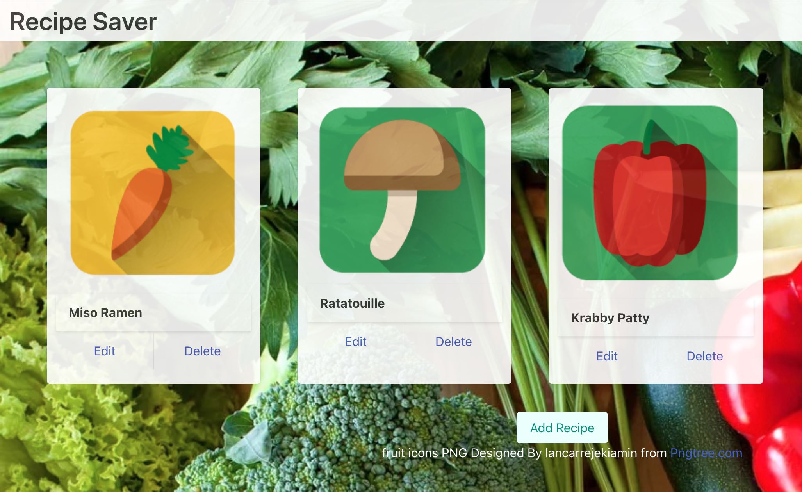
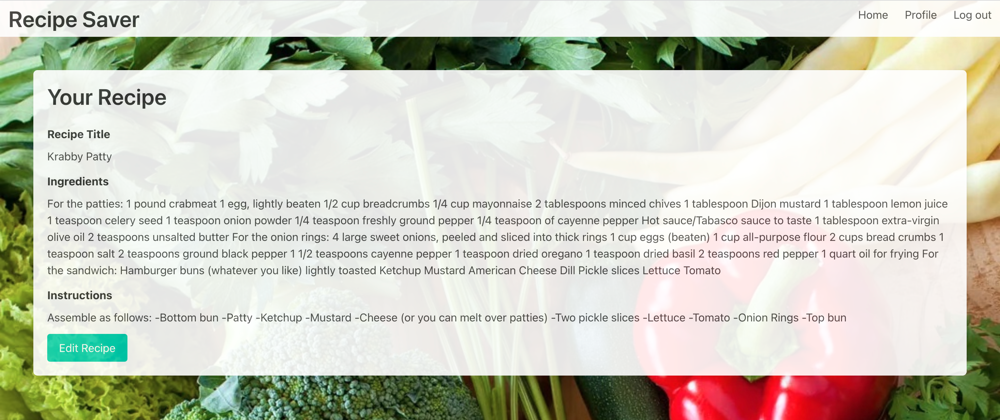

# Recipe-Saver
  
## Description
An easy application to store your favorite recipes. 

Still have your family recipes stored in that tin container while the cards start to disintigrate? Store your recipes here where they won't be lost to the elements. Keep track of old family recipes, new recipes you found online, or those family staples you made up yourself! Each will be stored easily in your profile for you to access and edit.
  
## Authors
#### Chandler Davis - echandlerdavis@gmail.com
#### Nolan Flannery - nolanflannery@gmail.com
#### Ahmed Muse - ahmed.hared@yahoo.com
#### Franky Erra - frankyerra1@gmail.com
#### Alyxandra Salvador

## Live Page:
 [Recipe Saver](https://group-2-recipe-saver.herokuapp.com/) 

## Screenshots:

## Table of Contents
### [Technologies](#technologies)
### [Usage](#usage)
### [License](#license)

## Technologies
  - Handlebars
  - Bulma
  - CSS
  - MySQL
  - NodeJS
    - Bcrypt
    - Sequelize
    - Dotenv
    - Express
    - Express-Handlebars
    - Express-Session
    - MySQL2

## Usage
* ### Log-in / Sign-up 
* ### Profile Page
  - This page will display all your saved recipes. You will have the option to edit/delete a specific recipe or add another recipe on this page
* ### Add Recipe Feature
  - Provide a recipe name, its ingredients, and preparation instructions then Save Recipe

* ### Edit Recipe Feature
  - Provide any necessary changes to your recipe name, its ingredients, and the preparation instructions

  
## License
This project is MIT Licensed
  

 